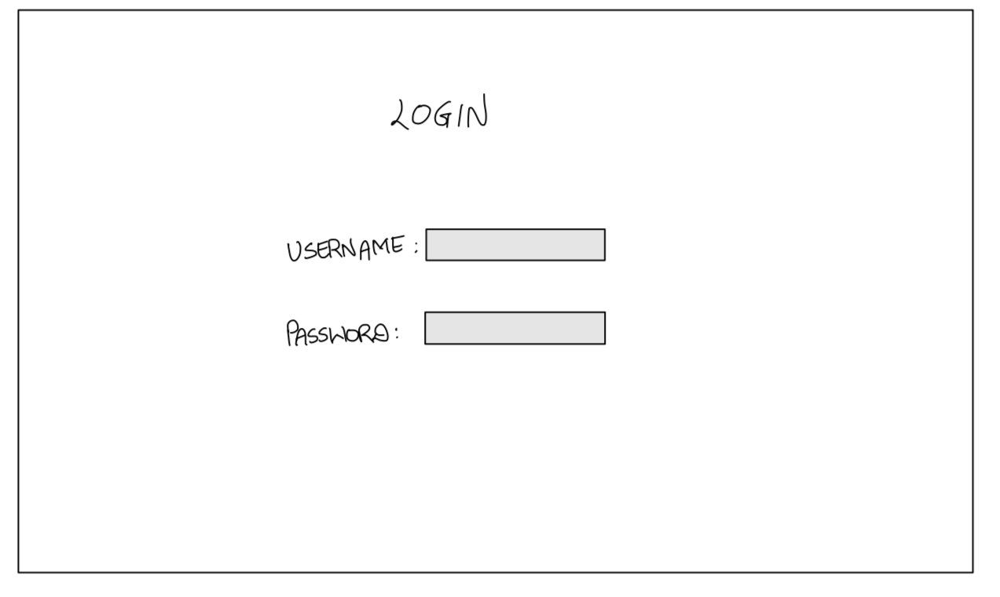

# TicketVista 

## Overview

TicketVista is an event ticket booking system that allows users to browse, select, and purchase tickets for various events, such as concerts, sports games, theater performances, and more. TicketVista is a dynamic full-stack web application designed to streamline the event ticket booking experience made using. With a user authentication system, it empowers users to explore and book event tickets effortlessly. Event organizers can easily create, manage, and update event listings with intuitive tools. Data is efficiently stored in a MongoDB database, ensuring reliable and scalable data management. Users can search, filter, and book event tickets, while enjoying a responsive HTML/CSS interface. The project demonstrates key web development concepts, including user authentication, CRUD operations for events and ticket bookings.


## Data Model

The application will store Users, Events and Review collection.

1. Users
    * Admin <br>
    Initially there is one admin, which can be increased via registration page. Admin can add new events, track number of participants in each event and can manually add participants to an event while creating an event.

    * Participants/ Users <br>
    Participants can see the list of available events and can book an event using event url.

<br>

2. Events <br>
  This collection consists of information on each event. <br>

<br>

3. Review <br>
  This collection is used to bind events and users. A participant can leave a feedback on the event, which will be stored in the collection.

<br>
An Example User:

```javascript
{
  username: "bond007",
  hash: // a password hash,
  admin: // a boolean value -> yes means admin, no means a participant,
  
  events: // an array of reference to bookings
}
```

An Example Event:

```javascript
{
  title: "Concert",
  date: "2023-11-15 19:00:00",
  venue: "City Hall",
  description: "A live music concert",
  price: "$50",

  participants: // an array of references to registered users,
  numUsers: // number of users
}
```

An Example Review:

```javascript
{
  user: // a reference to the user who submitted the feedback,
  event: // a reference to the event associated with the review,
  rating: 5, // A numerical rating (e.g., 1 to 5)
  reviewText: // A description of the review,
  timestamp: // date at which the review was dropped
}
```


## [Link to Commented First Draft Schema](db.mjs) 

<br>

## Wireframes


`/` - homepage


<br>

`/register` - Page to register a new user


<br>


`/login` - Page to login into an account



<br>


`/admin/newEvent` - Page to create a new event


<br>

`/admin/events` - Page to view all the events


<br>


`/u/:username/events` - Page to view all the events booked by an participant


<br>

`/u/:username/book` - Page to book an event


<br>

`/u/:username/feedback` - Page to submit a feedback for an event


<br>

## Site map

A general site map for the project is as follow. More features may be added if necessary. 


<br>

## User Stories or Use Cases

  1. As a non-registered user, I can create a new account on the site to book event tickets.
  2. As a non-registered user, I can add new admin(s) to manage the site.
  3. As a registered user, I can log in to the site to access my account.
  4. As a registered user, I can browse and view a list of upcoming events with event details and book them.
  5. As a user, I can view my booking history and see a list of events I've booked.
  6. As a user, I can leave reviews and ratings for events I've attended.
  7. As an admin, I can create, edit, and delete events, including setting event details. 
  8. As an admin, I can view the list of participants registered for an event.
  9. As an admin, I can manually add/ invite participants to an event.

<br>

## Research Topics

* (5 points) React
    * I'm going to be using React.js for front-end development.
    * React utilizes a component-based architecture, making it ideal for creating dynamic and interactive web applications.
    * It is widely used in modern web development due to its performance benefits and the ability to create reusable components.
    * The framework has a steep-learning curve so I have assigned it 5 points. 
* (3 points) Google reCAPTCHA Integration
    * Google reCAPTCHA is a technology used to distinguish between human and automated traffic on websites.
    * reCAPTCHA is essential for security and user experience, as it helps protect web applications from bots and ensures that interactions are initiated by real users.
    * I am going to use react-google-recaptcha module to integrate captcha into form a few submission of the web application.
* (2 points) Tailwind.css
    * I will be using tailwind to style my web application.
    * Tailwind.css promotes rapid development by providing a set of utility classes that can be applied directly to HTML elements.
    * Tailwind CSS promotes consistency in design and styling, thus it will help to bring a professional look to the project. 


## [Link to Initial Main Project File](app.mjs)

<br> 

## Annotations / References Used
1. [React Documentation](https://react.dev/learn)
2. Google reCAPTCHA Integration
    * [Library](https://www.npmjs.com/package/react-google-recaptcha)
    * [Google VP Console](https://www.google.com/recaptcha/admin/create)
3. [Tailwind.css Documentation](https://tailwindcss.com/docs/installation)
